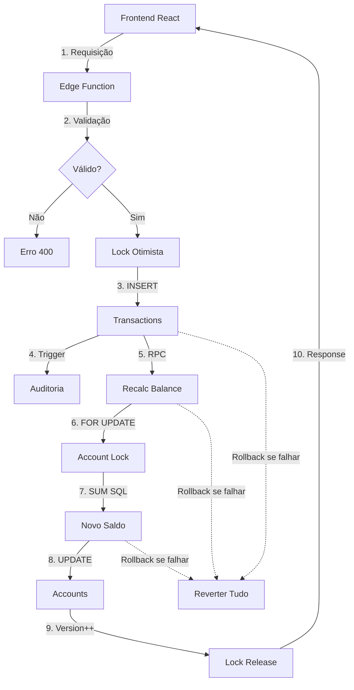

# 🏗️ ARQUITETURA PLANIFLOW - SISTEMA FINANCEIRO PROFISSIONAL

## 📐 VISÃO GERAL

O PlaniFlow é um sistema de gestão financeira pessoal construído com arquitetura robusta para garantir **consistência contábil**, **performance** e **auditabilidade**.

---

## 🔄 FLUXO DE DADOS ATÔMICO



---

## 🗄️ MODELO DE DADOS

### Tabelas Principais

#### **accounts** (Contas)
```sql
- id: UUID (PK)
- user_id: UUID (FK → auth.users)
- name: TEXT
- type: ENUM (checking, savings, credit, investment)
- balance: NUMERIC  -- Saldo atual
- limit_amount: NUMERIC  -- Limite/Cheque especial
- due_date: INTEGER  -- Dia vencimento (cartão)
- closing_date: INTEGER  -- Dia fechamento (cartão)
- color: TEXT
```

**Conceito Contábil:**
- **Checking/Savings**: Saldo positivo = dinheiro disponível
- **Credit**: Saldo representa dívida (negativo)
  - Limite - |Saldo| = Disponível

#### **transactions** (Transações)
```sql
- id: UUID (PK)
- user_id: UUID (FK → auth.users)
- account_id: UUID (FK → accounts)
- category_id: UUID (FK → categories)
- description: TEXT
- amount: NUMERIC  -- Sempre com sinal correto
- date: DATE
- type: ENUM (income, expense, transfer)
- status: ENUM (pending, completed)
- to_account_id: UUID  -- Para transferências
- linked_transaction_id: UUID  -- Dupla entrada
- installments: INTEGER  -- Total parcelas
- current_installment: INTEGER  -- Número parcela
- parent_transaction_id: UUID  -- Grupo de parcelas
- invoice_month: TEXT  -- YYYY-MM (cartão)
- reconciled: BOOLEAN  -- ✨ NOVO
- bank_reference: TEXT  -- ✨ NOVO
```

**Regras de Sinal:**
- `income`: amount > 0 (positivo)
- `expense`: amount < 0 (negativo)
- Transfer: `expense` (saída) e `income` (entrada) vinculadas

#### **financial_audit** (Auditoria) ✨ NOVO
```sql
- id: UUID (PK)
- user_id: UUID
- action: TEXT (insert, update, delete, balance_recalc)
- table_name: TEXT
- record_id: UUID
- old_values: JSONB  -- Estado anterior
- new_values: JSONB  -- Estado novo
- balance_before: NUMERIC
- balance_after: NUMERIC
- ip_address: INET
- user_agent: TEXT
- created_at: TIMESTAMPTZ
- created_by: UUID
```

**Triggers Automáticos:**
- Registra TODAS mudanças em `transactions`
- Captura saldos antes/depois
- Impossível alterar sem auditoria

#### **account_locks** (Locks Otimistas) ✨ NOVO
```sql
- account_id: UUID (PK, FK → accounts)
- version: INTEGER  -- Incrementa a cada update
- locked_by: UUID
- locked_at: TIMESTAMPTZ
- updated_at: TIMESTAMPTZ
```

**Como Funciona:**
1. Antes de recalcular: `SELECT version FOR UPDATE` (lock)
2. Recalcula saldo
3. Valida versão
4. Atualiza e incrementa versão
5. Se versão mudou: rollback e retry

---

## ⚡ EDGE FUNCTIONS (BACKEND)

### 1. `atomic-transaction` 
**Propósito:** Adicionar transação única com recálculo atômico

**Input:**
```json
{
  "transaction": {
    "description": "string",
    "amount": number,  // centavos
    "date": "YYYY-MM-DD",
    "type": "income" | "expense",
    "category_id": "uuid",
    "account_id": "uuid",
    "status": "pending" | "completed",
    "invoice_month": "YYYY-MM" (opcional)
  }
}
```

**Garantias:**
- ✅ Transação inserida OU rollback completo
- ✅ Saldo recalculado atomicamente
- ✅ Auditoria registrada automaticamente

---

### 2. `atomic-transfer`
**Propósito:** Transferência entre contas com dupla entrada garantida

**Input:**
```json
{
  "transfer": {
    "from_account_id": "uuid",
    "to_account_id": "uuid",
    "amount": number,  // centavos
    "date": "YYYY-MM-DD",
    "description": "string" (opcional)
  }
}
```

**Garantias:**
- ✅ Ambas transações criadas OU nenhuma
- ✅ Linked_transaction_id vincula as duas
- ✅ Validação de limites
- ✅ Ambos saldos recalculados atomicamente
- ✅ Rollback se qualquer etapa falhar

---

### 3. `atomic-edit-transaction`
**Propósito:** Editar transação(ões) com recálculo de saldo

**Input:**
```json
{
  "transaction_id": "uuid",
  "updates": {
    "description": "string",
    "amount": number,
    "status": "pending" | "completed",
    // ... outros campos
  },
  "scope": "current" | "all" | "current-and-remaining"
}
```

**Garantias:**
- ✅ Edita uma ou múltiplas (parcelas)
- ✅ Recalcula saldos afetados
- ✅ Rollback em caso de erro

---

### 4. `atomic-delete-transaction`
**Propósito:** Deletar transação(ões) com recálculo de saldo

**Input:**
```json
{
  "transaction_id": "uuid",
  "scope": "current" | "all" | "current-and-remaining"
}
```

**Garantias:**
- ✅ Deleta uma ou múltiplas (parcelas/vinculadas)
- ✅ Recalcula saldos afetados
- ✅ Transferências deletam ambas as partes

---

## 🔐 SEGURANÇA

### Row-Level Security (RLS)
Todas as tabelas têm RLS ativo:
- `accounts`: Usuário vê apenas suas contas
- `transactions`: Usuário vê apenas suas transações
- `financial_audit`: Usuário vê apenas seu histórico
- `account_locks`: Usuário vê apenas locks de suas contas

### Funções SECURITY DEFINER
```sql
-- Recalcular saldo (executa com privilégios elevados)
public.recalculate_account_balance(account_id, expected_version)

-- Auditoria (executa com privilégios elevados)
public.audit_transaction_changes()

-- Criar lock (executa com privilégios elevados)
public.create_account_lock()
```

### Validações em Camadas
1. **Frontend:** Validação UX imediata
2. **Edge Function:** Validação de negócio
3. **Database:** RLS + Constraints
4. **Triggers:** Auditoria automática

---

## 📊 PERFORMANCE

### Índices Estratégicos
```sql
-- Queries de listagem (mais comum)
idx_transactions_user_date (user_id, date DESC)

-- Queries de saldo
idx_transactions_account_status (account_id, status)

-- Queries de fatura de cartão
idx_transactions_invoice_month (account_id, invoice_month)

-- Queries de parcelas
idx_transactions_parent (parent_transaction_id)

-- Auditoria
idx_financial_audit_created_at (created_at DESC)
```

### Otimizações
- ✅ `SUM()` nativo do PostgreSQL ao invés de loops
- ✅ Queries com `WHERE` em colunas indexadas
- ✅ Paginação em listagens grandes
- ✅ Caching via Zustand stores

---

## 🧪 TESTES RECOMENDADOS

### Cenários Críticos

1. **Race Condition Test**
```typescript
// Enviar 100 transações simultâneas na mesma conta
Promise.all(
  Array(100).fill(0).map(() => 
    supabase.functions.invoke('atomic-transaction', {...})
  )
);
// Verificar: saldo deve ser exato
```

2. **Transfer Rollback Test**
```typescript
// Simular falha no meio da transferência
// Verificar: nenhuma transação criada
```

3. **Audit Trail Test**
```typescript
// Fazer operação
// Verificar: registro em financial_audit
```

---

## 📖 GLOSSÁRIO CONTÁBIL

### Partida Dobrada
Sistema onde cada operação afeta pelo menos 2 contas:
- **Débito**: Saída de dinheiro ou aumento de ativo
- **Crédito**: Entrada de dinheiro ou aumento de passivo

**No PlaniFlow:**
- Transferências implementam dupla entrada via `linked_transaction_id`
- Transações simples afetam apenas 1 conta

### Reconciliação
Processo de validar transações contra extrato bancário:
1. Importar extrato do banco
2. Comparar com transações registradas
3. Marcar como `reconciled` quando conferido
4. Identificar diferenças

### Fechamento de Período
Processo de consolidar dados de um período:
- Calcular totais
- Gerar relatórios
- "Trancar" transações passadas
- Calcular lucro/prejuízo

---

## 🎯 ROADMAP PARA NOTA 10

### Fase 3 (Programador - 0.5 pt)
- [ ] Remover console.logs ou criar logger condicional
- [ ] Criar tipos compartilhados (eliminar `any`)
- [ ] Adicionar testes básicos

### Fase 4 (Contador - 1.5 pt)
- [ ] Corrigir conceito de cartão de crédito
- [ ] UI de reconciliação bancária
- [ ] Relatórios: DRE, Balanço Patrimonial
- [ ] Sistema de fechamento mensal

---

## 🚀 DEPLOYMENT

### Edge Functions
Edge functions são deployadas automaticamente pelo Lovable.

### Validação Pós-Deploy
1. Testar cada edge function via Supabase dashboard
2. Verificar logs para erros
3. Executar query de auditoria:
```sql
SELECT * FROM financial_audit ORDER BY created_at DESC LIMIT 10;
```

---

**Mantido por:** Equipe PlaniFlow
**Última Atualização:** 18/11/2025