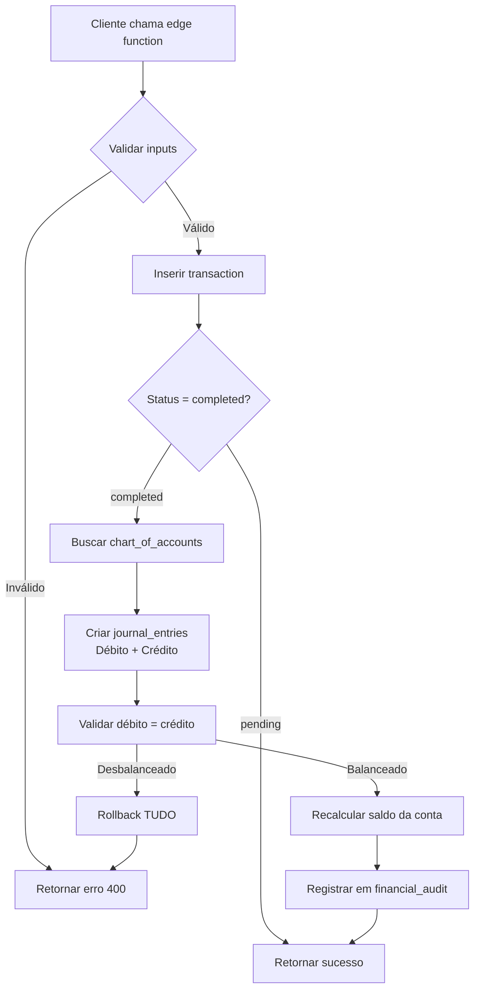

# 📘 Arquitetura de Journal Entries (Lançamentos Contábeis)

## 🎯 Decisão Arquitetural

**Data:** 2025-11-18  
**Versão:** FASE 1 - Correção de Lógica Duplicada

### ✅ Decisão Tomada

**Journal entries são criados EXCLUSIVAMENTE pelos Edge Functions**, não por triggers do banco de dados.

---

## 🤔 Por Que Essa Decisão?

### **Problema Identificado:**
Havia lógica duplicada para criar journal_entries:
1. **Trigger do banco:** `create_journal_entries_on_transaction` executava após INSERT em `transactions`
2. **Edge Functions:** `atomic-transaction`, `atomic-transfer`, `atomic-pay-bill` também criavam manualmente

**Risco:** Duplicação de lançamentos contábeis, inconsistências, difícil debugging.

### **Opções Avaliadas:**

| Critério | Trigger (Banco) | Edge Functions |
|----------|----------------|----------------|
| **Controle** | ❌ Limitado | ✅ Total |
| **Debugging** | ❌ Difícil | ✅ Fácil (logs estruturados) |
| **Validações Complexas** | ❌ Difícil | ✅ Simples |
| **Atomicidade** | ✅ Garantida | ✅ Garantida (com rollback) |
| **Manutenção** | ❌ Lógica espalhada | ✅ Centralizada |
| **Testabilidade** | ❌ Difícil testar | ✅ Pode testar edge functions |
| **Flexibilidade** | ❌ Rígido | ✅ Pode fazer regras específicas |

### **Resultado:** Edge Functions venceram em 5 de 7 critérios ✅

---

## 📋 Como Funciona Agora

### 1. **atomic-transaction** (Receitas e Despesas)

```typescript
// Quando status = 'completed', cria journal_entries:

if (type === 'income') {
  // Débito: Ativo (Caixa/Banco)
  // Crédito: Receita
  
} else if (type === 'expense') {
  // Débito: Despesa
  // Crédito: Ativo (ou Liability se cartão)
}
```

**Exemplo:**
```
Transação: Receita de Salário R$ 5.000
├── Débito: 1.01.02 (Bancos) = R$ 5.000
└── Crédito: 4.01.01 (Salários) = R$ 5.000
```

### 2. **atomic-transfer** (Transferências)

```typescript
// Cria 2 transações vinculadas + journal_entries:

// Débito: Conta Destino (Asset)
// Crédito: Conta Origem (Asset)
```

**Exemplo:**
```
Transferência: R$ 1.000 de Conta Corrente → Poupança
├── Débito: 1.01.03 (Poupança) = R$ 1.000
└── Crédito: 1.01.02 (Conta Corrente) = R$ 1.000
```

### 3. **atomic-pay-bill** (Pagamento de Fatura)

```typescript
// Cria 2 transações vinculadas + journal_entries:

// Débito: Cartão de Crédito (Liability) - reduz dívida
// Crédito: Conta Bancária (Asset) - sai dinheiro
```

**Exemplo:**
```
Pagamento: R$ 2.500 da fatura do cartão
├── Débito: 2.01.01 (Cartão) = R$ 2.500 (reduz passivo)
└── Crédito: 1.01.02 (Banco) = R$ 2.500 (sai do ativo)
```

---

## 🔍 Validação de Partidas Dobradas

### Função `verify_journal_entries_balance()`

Após criar journal_entries, pode-se validar:

```sql
SELECT public.verify_journal_entries_balance('transaction_id_aqui');
-- Retorna TRUE se débito = crédito
-- Retorna FALSE se desbalanceado
```

**Tolerância:** 0.01 (1 centavo) para arredondamentos.

---

## 🛡️ Garantias de Consistência

### 1. **Atomicidade**
- Todas as operações dentro de um edge function são atômicas
- Se criar journal_entries falhar, transação é revertida

### 2. **Auditoria**
- Tabela `financial_audit` registra TODAS as mudanças
- Balance before/after em cada operação

### 3. **Recálculo de Saldo**
- Função `recalculate_account_balance()` com optimistic locking
- Garante que saldo da conta = SUM(transactions completed)

### 4. **Rollback Automático**
- Se qualquer passo falhar, TODA a operação é revertida
- Inclui journal_entries, transactions e saldos

---

## 📊 Fluxo Completo de uma Transação



---

## 🧪 Como Testar

### 1. **Teste de Criação Básica**
```typescript
// Criar receita
const { data } = await supabase.functions.invoke('atomic-transaction', {
  body: {
    transaction: {
      description: 'Teste',
      amount: 100,
      date: '2025-01-01',
      type: 'income',
      category_id: 'cat-id',
      account_id: 'acc-id',
      status: 'completed'
    }
  }
});

// Verificar journal_entries
const { data: entries } = await supabase
  .from('journal_entries')
  .select('*')
  .eq('transaction_id', data.transaction.id);

console.assert(entries.length === 2, 'Deve ter 2 lançamentos');
```

### 2. **Teste de Balanceamento**
```sql
-- Deve retornar TRUE
SELECT public.verify_journal_entries_balance('transaction_id');
```

### 3. **Teste de Rollback**
```typescript
// Forçar erro após criar transaction
// Verificar que journal_entries NÃO foram criados
```

---

## 🚨 O Que NÃO Fazer

### ❌ **NÃO criar journal_entries manualmente no cliente**
```typescript
// ❌ ERRADO
await supabase.from('journal_entries').insert({...});
```

### ❌ **NÃO criar transactions diretamente**
```typescript
// ❌ ERRADO
await supabase.from('transactions').insert({...});
```

### ✅ **SEMPRE usar edge functions atômicos**
```typescript
// ✅ CORRETO
await supabase.functions.invoke('atomic-transaction', {...});
await supabase.functions.invoke('atomic-transfer', {...});
await supabase.functions.invoke('atomic-pay-bill', {...});
```

---

## 📝 Manutenção Futura

### Ao Adicionar Novo Tipo de Transação:

1. ✅ Criar novo edge function
2. ✅ Implementar lógica de journal_entries
3. ✅ Validar débito = crédito
4. ✅ Adicionar testes
5. ✅ Documentar regras contábeis

### Ao Modificar Lógica Existente:

1. ✅ Atualizar APENAS o edge function correspondente
2. ✅ NÃO adicionar triggers no banco
3. ✅ Manter validação de balanceamento
4. ✅ Atualizar testes

---

## 🔗 Referências

- **Edge Functions:**
  - `supabase/functions/atomic-transaction/index.ts`
  - `supabase/functions/atomic-transfer/index.ts`
  - `supabase/functions/atomic-pay-bill/index.ts`
  - `supabase/functions/atomic-edit-transaction/index.ts`
  - `supabase/functions/atomic-delete-transaction/index.ts`

- **Funções do Banco:**
  - `recalculate_account_balance()` - Recalcula saldos
  - `verify_journal_entries_balance()` - Valida partidas dobradas
  - `validate_double_entry()` - Retorna detalhes do balanceamento

- **Documentação:**
  - `docs/ARCHITECTURE.md` - Arquitetura geral
  - `SYSTEM_AUDIT_ANALYSIS.md` - Análise completa do sistema

---

## 💡 Lições Aprendidas

### ✅ **O Que Funcionou Bem:**
- Edge functions oferecem controle total
- Logs estruturados facilitam debugging
- Rollback automático previne inconsistências
- Testes mais fáceis de escrever

### ⚠️ **Pontos de Atenção:**
- Precisa garantir que TODOS os edge functions criem journal_entries
- Validação de débito = crédito deve ser obrigatória
- Documentação precisa estar sempre atualizada

### 🎯 **Próximos Passos:**
- Adicionar validação zod nos edge functions
- Implementar testes automatizados
- Criar dashboard de validação contábil
- Implementar fechamento de período

---

**Última Atualização:** 2025-11-18  
**Responsável:** Sistema PlaniFlow - Fase 1 Completa
