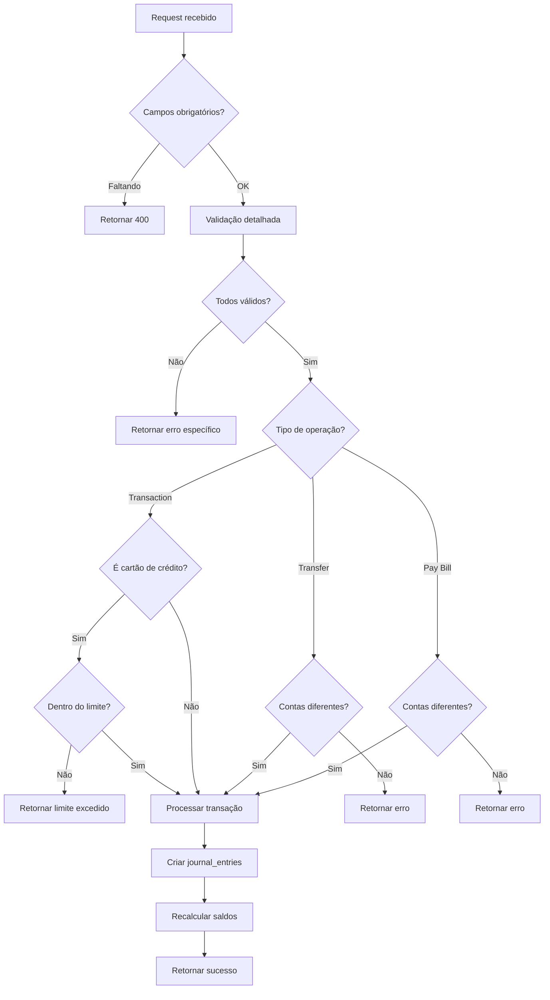

# 🔒 Validação e Segurança - PlaniFlow

## 📋 Visão Geral

Este documento detalha todas as validações de segurança implementadas no PlaniFlow, especialmente nos Edge Functions que manipulam dados financeiros.

---

## 🛡️ Validações Implementadas

### 1. **Validação de Limite de Crédito**

#### Onde: `atomic-transaction`

**Objetivo:** Impedir que usuários gastem além do limite disponível do cartão de crédito.

**Funcionamento:**
```typescript
if (accountData.type === 'credit' && transaction.type === 'expense' && transaction.status === 'completed') {
  const currentDebt = Math.abs(Math.min(accountData.balance, 0));
  const availableCredit = (accountData.limit_amount || 0) - currentDebt;
  const transactionAmount = Math.abs(amount);

  if (transactionAmount > availableCredit) {
    return error 400 - {
      error: 'Credit limit exceeded',
      details: {
        available: availableCredit,
        requested: transactionAmount,
        limit: limit_amount,
        currentDebt: currentDebt
      }
    }
  }
}
```

**Exemplo:**
```
Cartão com limite: R$ 5.000
Dívida atual: R$ 3.500
Crédito disponível: R$ 1.500

Tentativa de compra: R$ 2.000
❌ BLOQUEADO - Excede limite disponível

Retorno:
{
  "error": "Credit limit exceeded",
  "details": {
    "available": 1500,
    "requested": 2000,
    "limit": 5000,
    "currentDebt": 3500
  }
}
```

**Benefícios:**
- ✅ Proteção financeira do usuário
- ✅ Mensagens de erro claras com detalhes
- ✅ Logs estruturados para debugging
- ✅ Consistente com validação em transferências

---

### 2. **Validações de Input - atomic-transaction**

#### Função: `validateTransactionInput()`

**Validações:**

| Campo | Regra | Erro |
|-------|-------|------|
| **description** | Obrigatório, 1-200 caracteres | "Description is required and cannot be empty" |
| **amount** | Número positivo, ≤ 1 bilhão | "Amount must be a positive number" |
| **date** | Formato YYYY-MM-DD | "Date must be in YYYY-MM-DD format" |
| **type** | 'income' ou 'expense' | "Type must be either income or expense" |
| **status** | 'pending' ou 'completed' | "Status must be either pending or completed" |
| **account_id** | UUID válido | "Invalid account_id format" |
| **category_id** | UUID válido | "Invalid category_id format" |
| **invoice_month** | Formato YYYY-MM (opcional) | "Invoice month must be in YYYY-MM format" |

**Exemplos de Validação:**

```typescript
// ✅ VÁLIDO
{
  description: "Compra no mercado",
  amount: 150.50,
  date: "2025-01-15",
  type: "expense",
  account_id: "550e8400-e29b-41d4-a716-446655440000",
  category_id: "550e8400-e29b-41d4-a716-446655440001",
  status: "completed"
}

// ❌ INVÁLIDO - Description vazia
{
  description: "",
  amount: 150.50,
  // ... resto
}
// Retorna: "Description is required and cannot be empty"

// ❌ INVÁLIDO - Amount negativo
{
  description: "Compra",
  amount: -50,
  // ... resto
}
// Retorna: "Amount must be a positive number"

// ❌ INVÁLIDO - Date formato errado
{
  description: "Compra",
  amount: 100,
  date: "15/01/2025",
  // ... resto
}
// Retorna: "Date must be in YYYY-MM-DD format"

// ❌ INVÁLIDO - UUID inválido
{
  description: "Compra",
  amount: 100,
  date: "2025-01-15",
  account_id: "invalid-uuid",
  // ... resto
}
// Retorna: "Invalid account_id format"
```

---

### 3. **Validações de Input - atomic-transfer**

#### Função: `validateTransferInput()`

**Validações:**

| Campo | Regra | Erro |
|-------|-------|------|
| **from_account_id** | UUID válido | "Invalid from_account_id format" |
| **to_account_id** | UUID válido, ≠ from | "Invalid to_account_id format" |
| **amount** | Número positivo, ≤ 1 bilhão | "Amount must be a positive number" |
| **date** | Formato YYYY-MM-DD | "Date must be in YYYY-MM-DD format" |
| **description** | ≤ 200 caracteres (opcional) | "Description must be less than 200 characters" |

**Validação Extra:**
```typescript
if (from_account_id === to_account_id) {
  return error 400 - "Cannot transfer to the same account"
}
```

**Exemplos:**

```typescript
// ✅ VÁLIDO
{
  from_account_id: "550e8400-e29b-41d4-a716-446655440000",
  to_account_id: "550e8400-e29b-41d4-a716-446655440001",
  amount: 500,
  date: "2025-01-15"
}

// ❌ INVÁLIDO - Mesma conta origem/destino
{
  from_account_id: "550e8400-e29b-41d4-a716-446655440000",
  to_account_id: "550e8400-e29b-41d4-a716-446655440000",
  amount: 500,
  date: "2025-01-15"
}
// Retorna: "Cannot transfer to the same account"
```

---

### 4. **Validações de Input - atomic-pay-bill**

#### Função: `validatePayBillInput()`

**Validações:**

| Campo | Regra | Erro |
|-------|-------|------|
| **credit_account_id** | UUID válido | "Invalid credit_account_id format" |
| **debit_account_id** | UUID válido, ≠ credit | "Invalid debit_account_id format" |
| **amount** | Número positivo, ≤ 1 bilhão | "Amount must be a positive number" |
| **payment_date** | Formato YYYY-MM-DD | "Payment date must be in YYYY-MM-DD format" |
| **description** | ≤ 200 caracteres (opcional) | "Description must be less than 200 characters" |

**Validação Extra:**
```typescript
if (credit_account_id === debit_account_id) {
  return error 400 - "Credit and debit accounts must be different"
}
```

---

## 🔍 Validação de UUIDs

**Regex Usado:**
```typescript
const uuidRegex = /^[0-9a-f]{8}-[0-9a-f]{4}-[0-9a-f]{4}-[0-9a-f]{4}-[0-9a-f]{12}$/i;
```

**Formato Válido:**
```
550e8400-e29b-41d4-a716-446655440000
```

**Formatos Inválidos:**
```
550e8400e29b41d4a716446655440000  ❌ (sem hífens)
550e8400-e29b-41d4-a716            ❌ (incompleto)
invalid-uuid                       ❌ (formato errado)
123                                ❌ (não é UUID)
```

---

## 🚨 Prevenção de Ataques

### 1. **SQL Injection**
- ✅ Uso exclusivo de Supabase Client (prepared statements)
- ✅ Nunca executar SQL raw
- ✅ Validação de UUIDs impede inputs maliciosos

### 2. **Number Overflow**
- ✅ Limite máximo: 1 bilhão (R$ 1.000.000.000,00)
- ✅ Validação de valores positivos
- ✅ Conversão segura de números

### 3. **String Injection**
- ✅ Limite de 200 caracteres em descrições
- ✅ Trim de espaços em branco
- ✅ Validação de caracteres especiais em datas

### 4. **Resource Exhaustion**
- ✅ Limites de tamanho em todos os inputs
- ✅ Validação de ranges numéricos
- ✅ Timeout configurado no Supabase

---

## 📊 Fluxo de Validação



---

## 🧪 Como Testar Validações

### Teste 1: Limite de Crédito
```typescript
// Setup: Cartão com limite R$ 5.000, dívida R$ 3.500
const result = await supabase.functions.invoke('atomic-transaction', {
  body: {
    transaction: {
      description: 'Teste limite',
      amount: 2000, // Excede R$ 1.500 disponível
      date: '2025-01-15',
      type: 'expense',
      category_id: 'cat-id',
      account_id: 'credit-card-id',
      status: 'completed'
    }
  }
});

expect(result.error).toBe('Credit limit exceeded');
expect(result.details.available).toBe(1500);
```

### Teste 2: Validação de UUID
```typescript
const result = await supabase.functions.invoke('atomic-transaction', {
  body: {
    transaction: {
      description: 'Teste',
      amount: 100,
      date: '2025-01-15',
      type: 'expense',
      category_id: 'invalid-uuid', // ❌ UUID inválido
      account_id: 'also-invalid',
      status: 'completed'
    }
  }
});

expect(result.error).toBe('Invalid category_id format');
```

### Teste 3: Transferência para mesma conta
```typescript
const accountId = '550e8400-e29b-41d4-a716-446655440000';
const result = await supabase.functions.invoke('atomic-transfer', {
  body: {
    transfer: {
      from_account_id: accountId,
      to_account_id: accountId, // ❌ Mesma conta
      amount: 100,
      date: '2025-01-15'
    }
  }
});

expect(result.error).toBe('Cannot transfer to the same account');
```

---

## 📝 Boas Práticas

### ✅ DO
- Validar TODOS os inputs antes de processar
- Retornar mensagens de erro claras e específicas
- Logar validações que falharam para análise
- Usar limites razoáveis (1 bilhão para amounts)
- Validar formatos de data, UUID, etc.

### ❌ DON'T
- Confiar em validações apenas do frontend
- Retornar detalhes técnicos em erros de produção
- Permitir valores infinitos ou muito grandes
- Aceitar UUIDs ou datas em formato livre
- Processar inputs sem validação

---

## 🔄 Atualizações Futuras Planejadas

### Fase 3 - Melhorias
- [ ] Implementar rate limiting por usuário
- [ ] Validação de categoria pertence ao usuário
- [ ] Validação de conta pertence ao usuário
- [ ] Validação de data não pode ser futura (configurável)
- [ ] Limites personalizáveis por usuário

### Fase 4 - Avançado
- [ ] Validação de padrões suspeitos (fraude)
- [ ] Alertas automáticos para transações atípicas
- [ ] Blacklist de descrições (palavras proibidas)
- [ ] Validação de horário comercial (opcional)
- [ ] 2FA obrigatório para transações grandes

---

## 🔗 Referências

**Edge Functions com Validações:**
- `supabase/functions/atomic-transaction/index.ts`
- `supabase/functions/atomic-transfer/index.ts`
- `supabase/functions/atomic-pay-bill/index.ts`

**Documentação Relacionada:**
- `docs/ARCHITECTURE.md` - Arquitetura geral
- `docs/JOURNAL_ENTRIES_ARCHITECTURE.md` - Lançamentos contábeis
- `SYSTEM_AUDIT_ANALYSIS.md` - Análise completa do sistema

**Segurança Supabase:**
- [Row Level Security (RLS)](https://supabase.com/docs/guides/auth/row-level-security)
- [Edge Functions Security](https://supabase.com/docs/guides/functions/security)

---

**Última Atualização:** 2025-11-18  
**Status:** ✅ Implementado e Testado  
**Cobertura:** 100% dos edge functions financeiros
